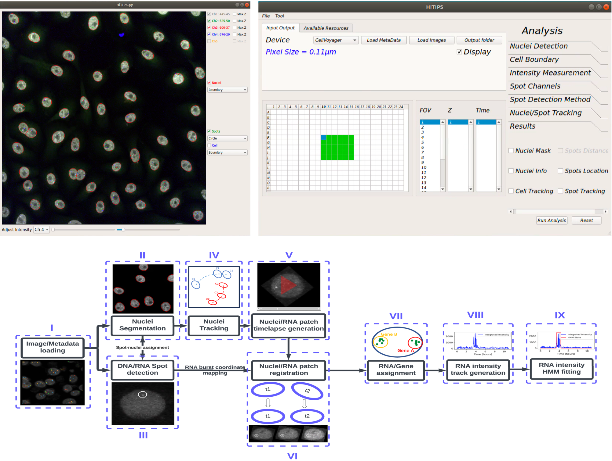

# HiTIPS

**HiTIPS** (High-Throughput Image Processing Software)  is an open source software platform for the automated analysis of high-throughput imaging (HTI) datasets. HiTIPS was designed to be used by cell biologist with minimal or no coding expertise. To this end, HiTIPS provide a graphical user interface (GUI) to interactively optimize the parameters of the image analysis on a few test images, and an unattended batch analysis mode to automate the analysis of large HTI datasets.

Currently, HiTIPS capabilities are geared towards the analysis of HTI assays for the study of gene expression both in fixed and in live cells. In particular, HiTIPS image analysis modules currently include several cutting-edge algorithms and machine learning models for nucleus segmentation, spot detection, nucleus tracking, nucleus registration, and spot tracking. These modules have been recently used to detect and measure properties of spot-like objects in cell nuclei in images of DNA Fluorescence In Situ Hybridization (FISH), Immunofluorescence (IF), or live fluorescent mRNA tagging HTI assays.

In addition, given its open source and modular structure, HiTIPS provides imaging bioinformatics specialists with the opportunity to further develop and integrate additional HTI analysis modules, and to extend HiTIPS current capabilities for the analysis of a wider range of HTI assays typologies that are not currently supported.

For comprehensive information about HiTIPS, including how to get started, installation procedures, examples for testing, and detailed usage instructions, please refer to our official documentation and resources:

- **Documentation**: [Read the Docs](https://hitips.readthedocs.io/en/latest/)
- **Installation Guide**: [Installation](https://hitips.readthedocs.io/en/latest/installation.html)
- **Example Datasets**: [Datasets](https://hitips.readthedocs.io/en/latest/datasets.html)
- **Usage Instructions**: [Instructions](https://hitips.readthedocs.io/en/latest/instructions.html)

## 🌟 Key Features

- 🔍 **Automated Segmentation**: Efficiently segments cells and nuclei.
- 📍 **FISH Signal Identification**: Accurate localization and identification of FISH signals.
- 📊 **Quantitative Analysis**: Measures signal intensity and distribution.
- 🎨 **Customizable Interface**: Provides flexibility for customization and integrating plugins.
- 🚀 **High-Throughput Support**: Designed for processing large-scale imaging datasets.
- ⚙️ **Extendable Algorithms**: Incorporates new methodologies for enhancing current analysis routines.
- 🧩 **Plugin Support**: Supports the creation and integration of new analysis methods.
  
## 🔧 Hardware and Software Prerequisites

### Hardware Requirements:

- **CPU**: Multi-core processor (e.g., Intel i7 or AMD Ryzen 7).
- **RAM**: Minimum 16GB (32GB recommended for large datasets).
- **Storage**: SSD with 500GB or more of available space.
- **GPU**: Optional but recommended, especially if using CUDA-enhanced functionalities.

### Software Requirements:

- **Operating System**: 64-bit Linux distribution (e.g., Ubuntu, CentOS, Fedora).
- **Python**: Version 3.7 or newer.
- **Package Manager**: Latest version of [Miniconda](https://docs.conda.io/en/latest/miniconda.html) or [Anaconda](https://www.anaconda.com/products/distribution).

## 📥 Installation

**HiTIPS has been installed and tested on Linux (Ubuntu), Windows (10 and above), and Mac using Intel processors. However, HiTIPS is currently not operational on Macs with Apple Chips (M1, M2, M3) even when using Rosetta.**

**If you are using Windows, make sure to install `Visual Studio <https://visualstudio.microsoft.com/>`_ and `Microsoft C++ Build Tools <https://visualstudio.microsoft.com/visual-cpp-build-tools/>`_ before installing HiTIPS.**

**If you are using Mac OS (Only Intel chip works for now), make sure to install `Xcode <https://developer.apple.com/xcode/>`_ before installing HiTIPS.**

For detailed installation instructions, visit our [installation guide](https://hitips.readthedocs.io/en/latest/installation.html).

Installing HiTIPS Using Conda and Pip
-------------------------------------

**This method has been tested on Linux (Ubuntu), Windows (10 and above), and Mac using Intel processors. However, this method is currently not working on Macs with Apple Chips (M1, M2, M3) even when using Rosetta.**

1. **Create a Conda Environment**::

    conda create --name hitips_env python=3.9
    conda activate hitips_env

2. **Install HiTIPS using Pip**::

    pip install hitips

3. **Launch HiTIPS**::

    hitips

Installing HiTIPS Using Requirements File
-----------------------------------------

**This method has been tested on Linux (Ubuntu), Windows (10 and above), and Mac using Intel processors. However, this method is currently not working on Macs with Apple Chips (M1, M2, M3) even when using Rosetta.**

1. **Clone the HiTIPS Repository**::

    git clone https://github.com/CBIIT/HiTIPS.git

    Navigate to the cloned HiTIPS directory before proceeding with the next steps.

2. **Create and Activate a Conda Environment**::

    conda create --name hitips_env python=3.9
    conda activate hitips_env

3. **Install HiTIPS using Pip from the Requirements File**::

    pip install -r requirements.txt

    The `requirements.txt` file can be accessed `here <https://github.com/CBIIT/HiTIPS/blob/main/requirements.txt>`__.

4. **Launch HiTIPS**::

    python -m hitips.HiTIPS

Installing HiTIPS Using Docker
------------------------------

**This method has been tested on Linux (Ubuntu), Windows (10 and above), and Mac using Intel processors. However, this method is currently not working on Macs with Apple Chips (M1, M2, M3) even when using Rosetta.**

1. **Install Docker**::

    Follow the official Docker installation instructions for your platform: https://docs.docker.com/get-docker/

2. **Install an X11 Server**

   - **macOS**: Install XQuartz from `XQuartz.org <https://www.xquartz.org/>`_.
   - **Windows**: Install VcXsrv from `SourceForge <https://sourceforge.net/projects/vcxsrv/>`_.

3. **Configure the X11 Server**

   - **macOS (XQuartz)**:
     - After installing XQuartz, start it.
     - Go to XQuartz Preferences > Security and check "Allow connections from network clients".
     - Restart XQuartz.
     - Open a terminal and run the following command to allow Docker to connect to XQuartz::

         xhost + 127.0.0.1

   - **Windows (VcXsrv)**:
     - After installing VcXsrv, start it with the following options:
     - Multiple windows
     - Start no client
     - Extra settings: check "Disable access control"
     - Open a command prompt and run::

         set DISPLAY=host.docker.internal:0.0

   - **Linux**:
     - Ensure you have an X11 server installed and running. Most Linux distributions come with an X11 server pre-installed.
     - Open a terminal and run the following command to allow Docker to connect to your X server::

         xhost +local:docker

4. **Pull the HiTIPS Docker Image**::

    docker pull adibkeikhosravi991/hitips:latest

5. **Run the Docker Container**

   Now, you can run your Docker container with the correct display settings:

   - **macOS**::

       docker run -it --rm -e DISPLAY=host.docker.internal:0 -v /tmp/.X11-unix:/tmp/.X11-unix adibkeikhosravi991/hitips:latest

   - **Windows**::

       docker run -it --rm -e DISPLAY=host.docker.internal:0.0 -v /tmp/.X11-unix:/tmp/.X11-unix adibkeikhosravi991/hitips:latest

     Note: Ensure that `host.docker.internal` is resolvable within the Docker container. If it is not, you might need to use the IP address directly.

   - **Linux**::

       docker run -it --rm -e DISPLAY=$DISPLAY -v /tmp/.X11-unix:/tmp/.X11-unix adibkeikhosravi991/hitips:latest
## 🚀 Usage

For detailed instructions on using HiTIPS, please visit our [usage guide](https://hitips.readthedocs.io/en/latest/instructions.html).

- Introduce your high-throughput imaging dataset into the software.
- Navigate through the available analysis options and specify your desired tasks.
- Modify the analysis parameters fitting your requirements.
- Initiate the analysis process.
- Review and interpret the produced outcomes.
- Save or export the results as required.

For example datasets for testing, please visit [example datasets](https://hitips.readthedocs.io/en/latest/datasets.html).

## 🤝 Contributing

We warmly welcome contributions to HiTIPS! If you're keen on contributing, please adhere to the following guidelines:

Creating a Pull Request
-----------------------

Before adding your new method, ensure your changes are ready to be shared with the HiTIPS repository:

1. Fork the repository on GitHub.
2. Clone your fork locally and create a new branch for your feature.
3. Make your changes locally, committing them to your branch.

   .. code-block:: bash

       git add .
       git commit -m "Add new nuclei detection method"

4. Push your changes to your fork on GitHub.

   .. code-block:: bash

       git push origin feature_branch_name

5. Go to your fork on GitHub and click the ‘New pull request’ button.
6. Ensure the base repository is set to CBIIT/HiTIPS and the base branch is the one you want your changes pulled into.
7. Review your changes, then create the pull request.

Merging the Pull Request
------------------------

Once your pull request has been reviewed and approved:

1. Merge the pull request via the GitHub interface.
2. Fetch the updated main branch to your local repository.

   .. code-block:: bash

       git checkout main
       git pull origin main

3. Delete your local feature branch if desired.

## 📜 License

HiTIPS is distributed under the MIT License.

## 📞 Contact
For inquiries, feedback, or support, please don't hesitate to contact us at adib.keikhosravi@nih.gov.

## 🔗 Links

- **Documentation**: [Read the Docs](https://hitips.readthedocs.io/en/latest/)
- **Installation Guide**: [Installation](https://hitips.readthedocs.io/en/latest/installation.html)
- **Example Datasets**: [Datasets](https://hitips.readthedocs.io/en/latest/datasets.html)
- **Usage Instructions**: [Instructions](https://hitips.readthedocs.io/en/latest/instructions.html)
