Usage Guide
===========

**HiTIPS** (High-Throughput Image Processing Software) is a comprehensive tool crafted for the analysis of high-throughput imaging datasets. Specifically designed for FISH (Fluorescence In Situ Hybridization) data, HiTIPS incorporates cutting-edge image processing and machine learning algorithms, delivering automated solutions for cell and nucleus segmentation, FISH signal identification, and quantification of signal attributes.

Key Features
------------

- **Automated Segmentation**: Efficiently segments cells and nuclei.
- **FISH Signal Identification**: Accurate localization and identification of FISH signals.
- **Quantitative Analysis**: Measures signal intensity and distribution.
- **Customizable Interface**: Provides flexibility for customization and integrating plugins.
- **High-Throughput Support**: Designed for processing large-scale imaging datasets.
- **Extendable Algorithms**: Incorporates new methodologies for enhancing current analysis routines.
- **Plugin Support**: Supports the creation and integration of new analysis routines.

HiTIPS user interface
---------------------
HiTIPS unser interface consists of two windows: one for displaying the image and realtime results of cell and spots segmentation, and the other one for image and dataset loading, image selection for display and selecting analsysis parameters as well as running the analysis. 

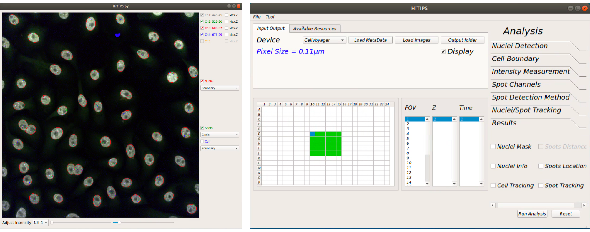

Data loading from CellVoyager
-----------------------------
- From “Input Output” tab click on “Load MetaData” button.

- Using the “Select Metadata Files…” window navigate into the folder containing all the images and metadata saved by the instrument.

- You should only see the file “MeasurementData.mlf”. Select this file and click ”Open”.

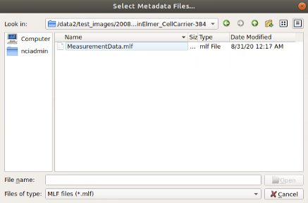
   
Loading plate information from CellVoyager
------------------------------------------
- Once the plate information is loaded in HiTIPS you should see the “pixel size” value under device label and the ”Display” checkbox is active.

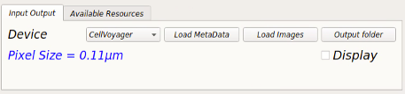

- Now check the “Display” checkbox to see all the wells containing images with their corresponding fields (FOV), Z planes and time points (Time).

  -- The color of wells containing image data on the well-plate layout will change to green now.
  
  -- To view other images you can click on the well, field, z-plane or timepoint of interest.
  
  -- This should also load the first image of the dataset into the display window.

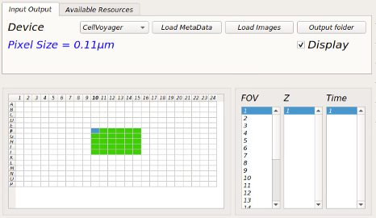
   
Loading Bioformat image files
-----------------------------

- From “Input Output” tab click on “Load Images” button 

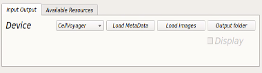
   
- Using the “Select Image Files…” window navigate into the folder containing all the images (ome.tiff, czi, nd2, ims, etc.) and select all the images required to be analyzed.

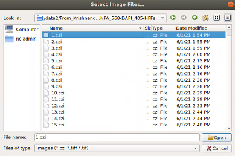

Loading Configuration File
-----------------------------

- The configuration files from previous analyses can be loaded to run the new analysis. To load the configuration file, from dropdown menus, go to "Tool" => "Load Configuration" and using the select window openned, select the configuration file and click "Open".

- Configuration files are automatically saved in the output folder when running the analysis. However, they can also be saved indipendently by clicking "Tool" => "Save Configuration".
   
Image Display window
--------------------

- After loading plate information and checking display checkbox all the active channels in the dataset will be active and the channel information will be displayed next to the channel name.

- You can also check the “Max.Z” checkbox for each channel to display the maximum projection of the Z-stack.

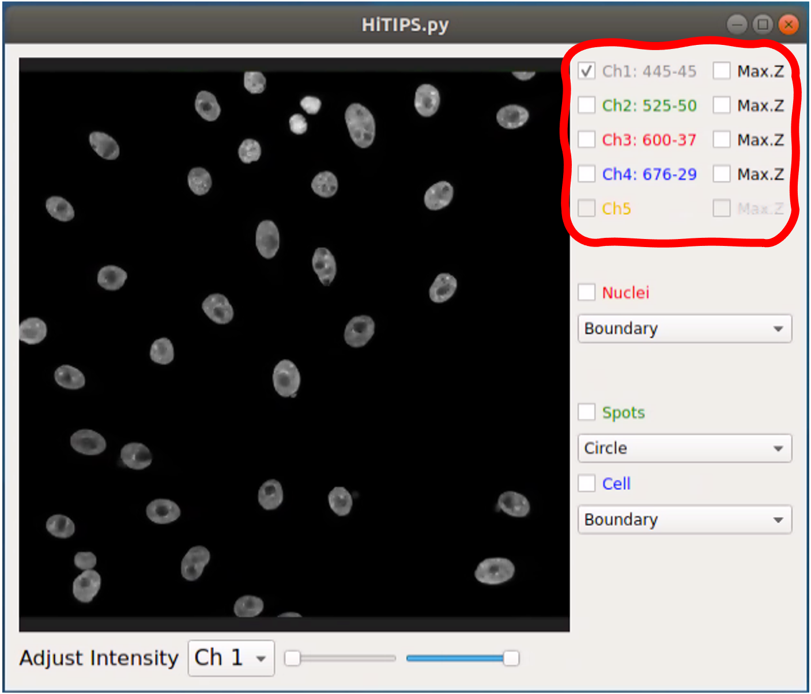
   
- You can select the color of the channel by right-clicking on text next to its checkbox and selecting the color from the dropdown menu.

Adjusting channel intensities
-----------------------------

- Up to five channels can be displayed in displayed and the display intensity can be separately adjusted for each channel separately.

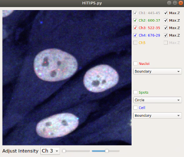
   
- You can adjust the intensity of each channel by selecting the specific channel from the combobox under the image and using the right slider to set the maximum intensity and left slider to set the minimum intensity of the image.

  -- Note: adjusting the image intensity on the display window will not change the input image intensities for processing algorithms (nuclei segmentation, spot detection, etc.). These algorithms read and process the raw data.

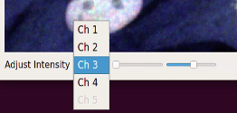
   
   
Visualizing nuclei segmentation results
---------------------------------------
- To visualize the nuclei segmentation results, check the “Nuclei” checkbox on the right side of the display window. 

- From the combobox under this checkbox you can select how you would like to visualize the segmentation results. You can select nuclei boundary, area or the nuclei index. The examples are shown below. 

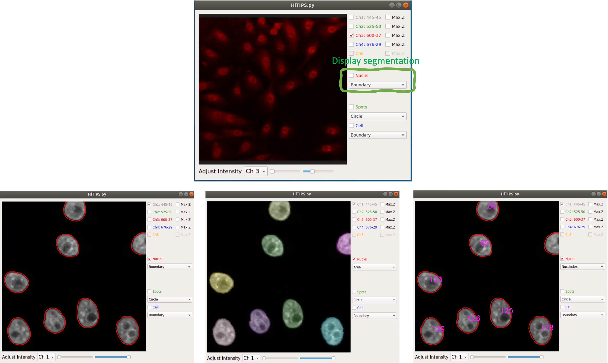
   
   
Visualizing spot detection results
----------------------------------

- To visualize the spot detection results, check the “Spots” checkbox on the right side of the display window. 

- From the combobox under this checkbox you can select how you would like to visualize the spot detection results results. You can select circles around spots or spot boundary. 

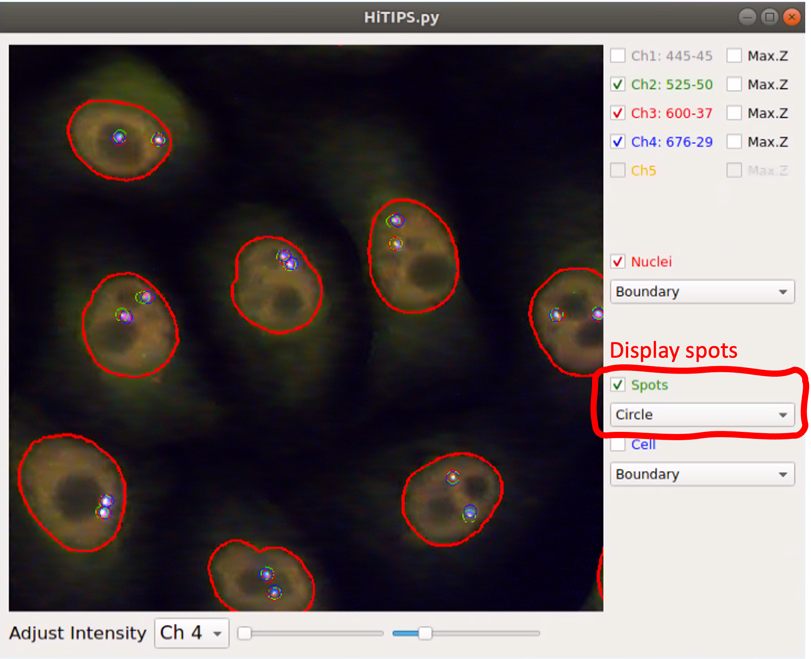
   

Nuclei Detection Parameter Setting
----------------------------------

The effect of changing any of the parameters in this toolbox can be observed on display window in real-time to achieve the best possible result.

- Channel: for selecting the channel containing nuclei stain to run nuclei segmentation.

- Method: for selecting nuclei segmentation method from: Int.-based, Marker Controlled, CellPose-CPU, CellPose-GPU, DeepCell.

  -- Note: the first three methods don’t require GPU for processing but the last two methods require GPU for segmentation.

- Detection: Increasing the value of this slider will increase the chance of detecting the nuclei with lower intensity. It might also add noise to segmentation, so choosing the proper value is important.

- Separation: increasing this value would help separating attached nuclei but very high values can result in over segmentation.

  -- Note: Detection and separation sliders are only read but first two segmentation methods (Int.-based and Marker Controlled) and have no effect on other methods.

- Area: estimated area of an average nuclei in the dataset (µm²)

  -- Note: if you are using CellPose, sometimes very high values leads to better results.

- Remove Boundary Nuclei: checking this checkbox will eliminate the nuclei touching the boundary of the image to make sure all the detected nuclei are intact.

- MaxZ Projection: by checking this checkbox, the nuclei segmentation algorithm will run on the maximally projection of the Z-planes. 

  -- Note: if the 2D segmentation of the nuclei is required make sure this chechbox is checked, since it will highly improve 2D segmentation results.

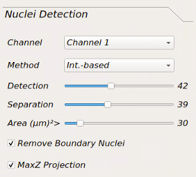
   
   
Spot Channels
-------------

- Channels checkboxes: Using these checkboxes you can select the channels containing spots.

- Coordinates: you can select the location on the spot as the defining point of the spot.

  -- CenterOfMass: weighted average of all the pixels on each segmented spot. The weights are pixels intensity.
  
  -- MaxIntensity: location of brightest pixel on the segmented spot.

  -- Centroid: average of all the pixels on each segmented spot. Similar to first CenterOfMass, but all the weights are equal to 1.

- Max z-projection: by checking this checkbox, the spot detection algorithm will run on the maximally projection of the Z-planes. 

  -- Note: for achieving best results make sure this chechbox is checked, since it will highly improve the detection of spots in 2D and the Z location will be returned as location of a plane containing the maximum intensity.

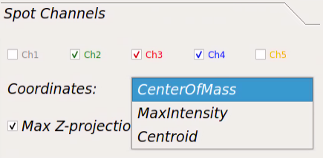

Spot Detection Method
---------------------

- Channel: If different algorithms or parameters require for different spot channels you can select that specific channel and adjust rest of the parameters for that channel. Otherwise you can choose “All” to use the same parameters for all channels.

- Detection Method: for selecting spot detection method from:

  -- Laplacian of Gaussian: fits an LOG kernel to every pixel.

  -- Gaussian: fits a Gaussian kernel to every pixel.
  
  -- Intensity Threshold: segmenting spots usingintensity thresholding.

  -- Enhanced LOG: A combination of first two methods.
  
- Threshold Method: for selecting the thresholding method after kernel fitting:
  
  -- Auto: for using Otsu’s thresholding method for separating spots from background.

  -- Manual: for setting the threshold manually to separate spots from background.
  
  -- Note: Auto thresholding would not work well if you choose Gaussian kernel. A comparison of these methods can be found in slides Appendix 2.

- Threshold Value: set the threshold for spot segmentation after kernel fitting. This threshold will only be applied when the “Threshold Method” is set to “Manual”.

- Kernel Size: to set the kernel size for Gaussian and LOG methods. A smaller value makes the algorithm more sensitive to detect spots but may result in many false positives. Higher values would result in less false positives but may not be sensitive enough to detect all true positives. This value should be set according to dataset while observing the results.

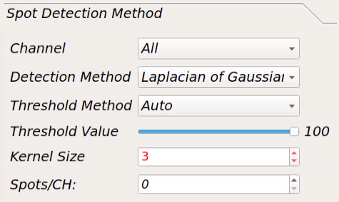
   
   
Nuclei and Spot Tracking
------------------------

- Nuclei Tracking: for selecting nuclei tracking method. Currently there are two options: Bayesian and DeepCell. 

- Nuc Search Radius (Pix): the radius of search for Bayesian method in pixels. It is recommended to use the default value(100). If the accuracy of tracking not satisfactory, you can reduce or increase this value.

- Spot search Radius (pix): maximum displacement for the spot to be considered the same for intial clustering of the spots.

- Secondary Spot Search Radius: maximum displacement for the spot to be considered the same for retrospective assignment of the spots.

  -- Note: Both these methods will be applied after aligment of the spots over time. So the nuceli movement and rotation don't need to be considered for adjusting 
     these parameters.
     
- Min Track Length (Frames): Do not include the nuclei that have been tracked less than this value in the results.

- Track Registration Method: You can currently choose between 'Phase Correlation' (Default) and 'Intensity Based' registration methods. 
  The 'Intensity Based' registration approach has been proven to work better when cells shape changes during along the movement on their trajectory, however, large frame-to-frame intensity variations can introduce angle shift or translation in the registration results. On the other hand, the 'Phase Correlation' is more robust to intensity change and less robust to frame-to-frame shape deformation.
  
- Fitting Method: For choosing the the method to fit a two or three state HMM model to the intensity of the tracked spots.

- Max Spots Per Cell: In a tracked nuclei, if for one frame more spots are detected than this value due to the background noise, that frame will be ignored for spot tracking. 

- Min Burst Duration (frames): Remove that spots from analysis, if they are only present in less number of frames than this value. This will also help remving the background noise detected in a smallnumber of frames due to background noise.

- Patch Size (pix): Size of image image patch for saving the nuclei time stacks.

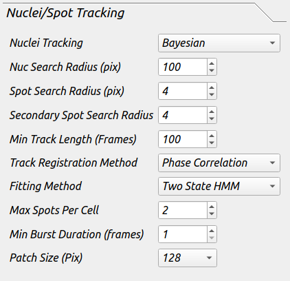

Results
-------

This tab included the resutls that are needed to be saved after the analysis is done.

- Nuclei Mask: this will save the binary mask images for the channel selected as nuclei.

- Nuclei Info: this will save all information related to each nuclei in the dataset (location, shape information, intensity etc.).

- Spots Location: this will save all information related to each spot in the dataset.

- Cell Tracking: this will save all images and results table for every tracked nuclei.

- Spot Tracking: this will save all images and results table for every tracked spot in the dataset.

-Note if you need to save Nuclei or Spot tracking results, all the boxes need to be checked.

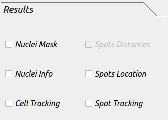

Running Batch Analysis
----------------------

- Before running the analysis, make sure you have selected a location to save the output files. Under "Input Output" tab, click "Output folder" and select the location to save the results.

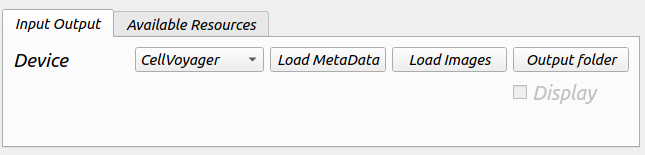
   
- If you are running HiTIPs in parallel mode, under "Available Resources" tab, select the number of CPU cores you would like to use for your analysis. If you are only using CPU methods, the number of cores you can use will be determined by the number of cores that are avaible to you and the system memory. However, if you are using any GPU method (such as CellPose) in your analysis pipeline, we recommend using maximum 5 cores. The GPU selection is depricated and will be removed in new versions.

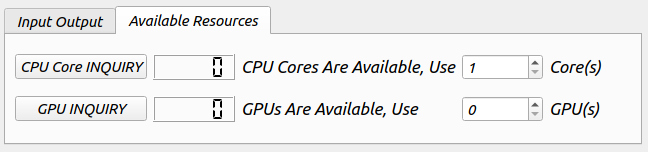